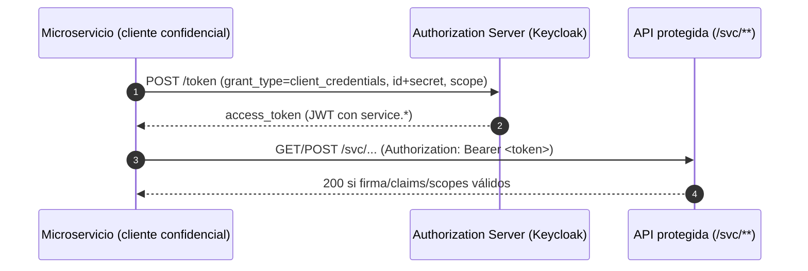
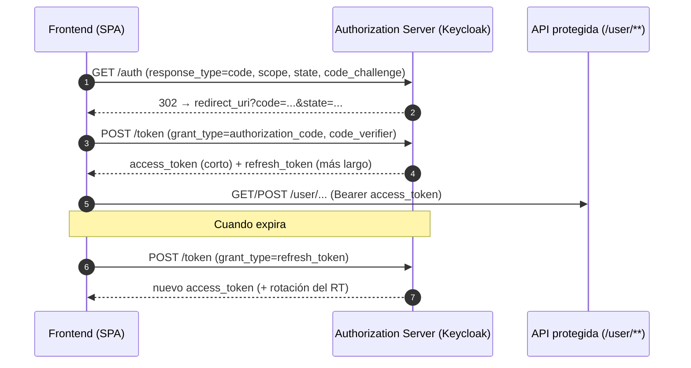
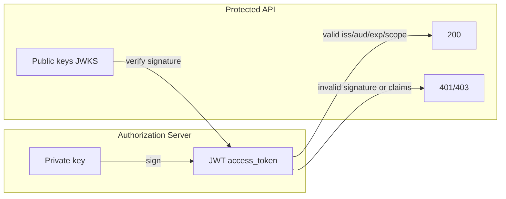
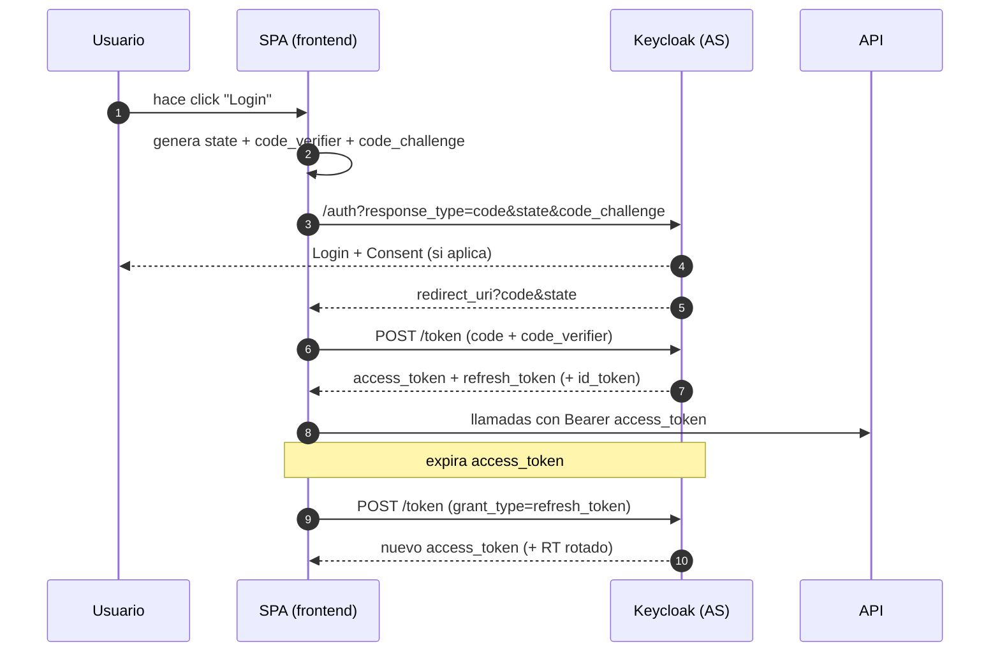

# OAuth 2.0 en la práctica: Client Credentials + Authorization Code (PKCE & Refresh)

**Rita Trindade, Brando Merchan**

---

## 📹 Video explicativo (10–15 min)

Puedes ver la demostración completa del proyecto en el siguiente enlace:  
🎥 [Video explicativo en YouTube](https://youtu.be/XIZK-PO6w4M?si=XuOw9H1utovhqzSD)
## 🐳 Docker Hub

Para clonar y ejecutar la imagen del proyecto:

```bash
docker pull ritatrcr/reverent-banzai:tagname


## Slide 1 — Objetivo del video

* Implementar **dos flujos**: Client Credentials (svc↔svc) y Authorization con Refreshtoken + **PKCE + Refresh** (usuario final).
* Mostrar **tiempos de token**, **refresh** funcionando, **scopes** (read/write) y por qué el token de microservicio **no sirve** en frontend.

**Notas del presentador**: Esta es la ruta al 5/5 en la rúbrica: AS configurado, API validando tokens, demo en Postman+SPA, HTTPS y scopes claros.

---

## Slide 2 — Arquitectura general

* **Frontend (SPA)** ↔ **Authorization Server (Keycloak)** ↔ **API protegida**
* **Microservicio** (cliente confidencial) ↔ **AS** ↔ **API /svc**
* Validación **JWT** en API vía **JWKS (clave pública)**.

**Notas**: API no pregunta al AS en cada request; valida firma y claims localmente.

---

## Slide 3 — ¿Por qué Authorization Code + PKCE?

* Evita exponer tokens en redirecciones (token se obtiene por back-channel).
* **PKCE** protege el *code* (previene interceptación/replay).
* Soporta **Refresh Tokens** (experiencia sin re-login), rotación opcional.
* Sustituye **Implicit** y evita **Password/ROPC** en front.

---

## Flujo 1: Client Credentials (resumen)

* Caso: **svc→svc** (sin usuario).
* Cliente confidencial usa **client_id + client_secret** para obtener **access_token**.
* Token incluye scopes **service.read / service.write**.



**Notas**: No hay refresh token por defecto en CC; emisores suelen no darlo en este grant.

---

## Slide 5 — Flujo 2: Authorization + Refresh

* Caso: **usuario final** (SPA/web/móvil).



**Notas**: Con rotación ON, el RT anterior queda invalidado al usar el nuevo.

---

## Slide 6 — JWT: firma y validación

* El AS firma el **access_token (JWT)** con **clave privada**.
* La API valida **firma** con **clave pública (JWKS)** y comprueba **claims**: `iss`, `aud`, `exp`, `scope`.



**Notas**: Rotación de claves → `kid` en header del JWT; API obtiene la pública correcta del JWKS.

---

## Slide 7 — Scopes y autorización

* **service.read / service.write** → rutas `/svc/**` (microservicios).
* **user.read / user.write** → rutas `/user/**` (usuarios).
* **Principio de menor privilegio**: pide solo lo necesario.

| Ruta          | Método | Scope requerido |
| ------------- | ------ | --------------- |
| /svc/data     | GET    | service.read    |
| /svc/data     | POST   | service.write   |
| /user/profile | GET    | user.read       |
| /user/profile | POST   | user.write      |

---

## Slide 8 — Tiempos de token & rotación

* **Access Token**: corto (p. ej. 5–10 min).
* **Refresh Token**: más largo (p. ej. 30–60 min), **rotación** opcional.
* En la SPA mostramos **contador de expiración** (`exp`) y probamos refresh.

**Notas**: En refresh **no** mandes `scope` (se conservan los otorgados).

---

## Slide 9 — Demo: Client Credentials (Postman)

1. POST `/token` con `grant_type=client_credentials` (id+secret, `scope=service.read service.write`).
2. Usar token en `/svc/data` (GET→200, POST→200 si `service.write`).
3. Probar token de microservicio en `/user/profile` → **403/401**.

**Notas**: Mostrar decodificación del JWT (claims, `exp`, `scope`).

---

## Slide 10 — Demo: Authorization Code + PKCE (SPA)

1. Iniciar login (PKCE) → vuelve con `code` → canjear por **access + refresh**.
2. GET `/user/profile` (200) y POST `/user/profile` (200 si `user.write`).
3. Dejar expirar access → 401 → **Refresh** → repetir llamada (200).
4. **Probar RT viejo** (si rotación ON) → **invalid_grant**.

---

## Slide 11 — Demo: Scopes en acción

* Login **solo con `user.read`** → GET OK, POST **403**.
* Repetir pidiendo también **`user.write`** → POST **200**.

**Notas**: En Client Credentials, omitir scope → solo Defaults; pedir `service.write` explícito cuando haga falta.

---

## Slide 12 — HTTPS y CORS

* Todo tráfico por **HTTPS** (cert confiable en navegador para `https://localhost:8443`).
* Configurar **Web Origins** y **Redirect URIs** exactos en Keycloak.

---

## Slide 13 — Errores típicos (y solución)

* `PKCE code verifier not specified` → no se guardó/enviò `code_verifier`.
* `invalid_grant` → `code` usado/expirado o `redirect_uri`/`client_id` distintos.
* `unauthorized_client` → flow/PKCE/Direct Grants no habilitados para ese cliente.
* **403 vs 401** → 401=token inválido/expirado, 403=falta scope.

---

## Slide 14 — Buenas prácticas

* PKCE obligatorio en clientes **públicos**.
* Access **corto**, refresh con **rotación**.
* Validar `iss`, `aud`, `exp`, `scope` y **firma** siempre.
* **Scopes mínimos** y separación `service.*` vs `user.*`.
* Considerar **BFF** en producción para manejar tokens del lado servidor.

---

## Slide 15 — Cierre & Entregables

* **AS** configurado (export del realm) con ambos flujos.
* **API** validando JWT y scopes.
* **Video** con Postman + SPA mostrando tokens, refresh, scopes y HTTPS.

**Notas**: Adjuntar README, colección de Postman y scripts.

---

## Apéndice A — Secuencia completa Auth Code + PKCE + Refresh



---

## Apéndice B — Validación de scopes en el API (ejemplo lógico)

```pseudo
if route startsWith "/svc/":
  require scope in {"service.read" (GET), "service.write" (POST/...)}
else if route startsWith "/user/":
  require scope in {"user.read" (GET), "user.write" (POST/...)}
else:
  404
```

---

## Apéndice C — Campos JWT a revisar

* `header.kid` (selección de clave pública)
* `iss` (issuer del realm correcto)
* `aud` (audiencia esperada)
* `exp` / `nbf` (tiempos válidos)
* `scope` (contenga el requerido)
* `sub` (identidad del sujeto)

---

## Apéndice D — Comandos clave (referencia rápida)

* **Client Credentials**

```
curl -X POST "$TOKEN_URL" -H "Content-Type: application/x-www-form-urlencoded" \
  -d "grant_type=client_credentials&client_id=microservice-client&client_secret=...&scope=service.read service.write"
```

* **Refresh Token**

```
curl -X POST "$TOKEN_URL" -H "Content-Type: application/x-www-form-urlencoded" \
  -d "grant_type=refresh_token&client_id=frontend-client&refresh_token=<RT>"
```

* **Llamada API**

```
curl -k -H "Authorization: Bearer <ACCESS>" https://localhost:8443/user/profile
```
